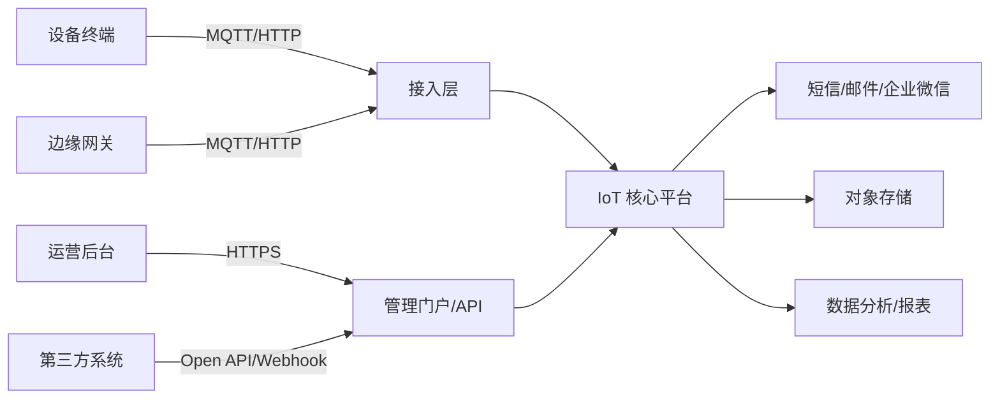
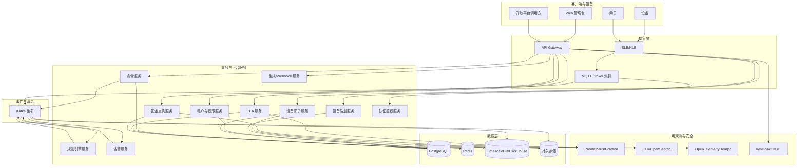
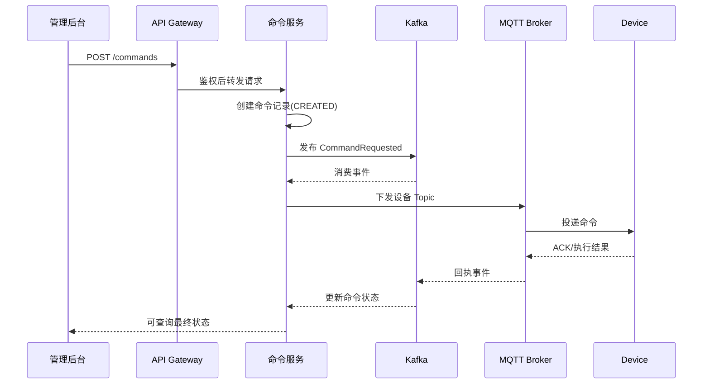
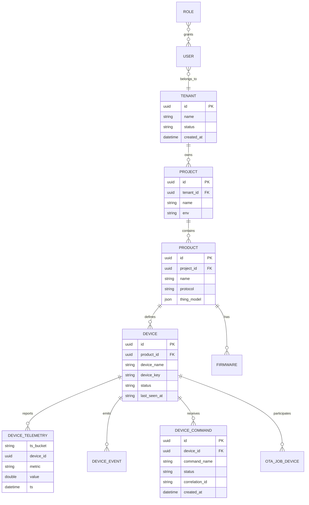
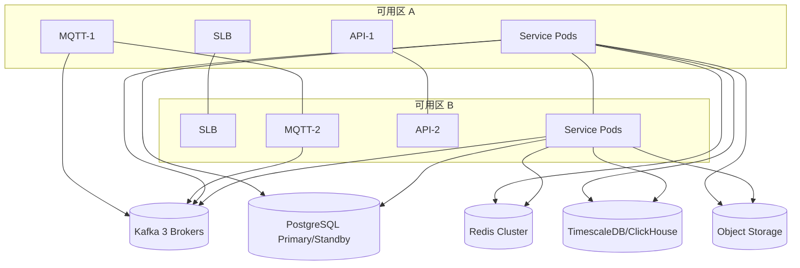

# 物联网管理系统架构方案（20万设备）

**Document Version:** 1.0  
**Date:** 2026-03-08  
**Author:** System Architect  
**Status:** Draft

---

## 目录

1. [系统概述](#1-系统概述)
2. [需求假设与容量测算](#2-需求假设与容量测算)
3. [架构决策过程](#3-架构决策过程)
4. [总体架构](#4-总体架构)
5. [核心组件设计](#5-核心组件设计)
6. [数据模型设计](#6-数据模型设计)
7. [接口与主题规范](#7-接口与主题规范)
8. [非功能需求映射](#8-非功能需求映射)
9. [技术栈选型](#9-技术栈选型)
10. [部署架构与容量规划](#10-部署架构与容量规划)
11. [权衡分析](#11-权衡分析)
12. [演进路线](#12-演进路线)

---

## 1. 系统概述

### 1.1 目标

设计一个面向 **20 万台设备** 的物联网管理系统，支持设备接入、设备档案管理、在线状态监控、遥测数据采集、远程命令下发、告警、OTA 升级、租户隔离与运营后台。

### 1.2 业务范围

**In Scope:**
- 设备注册、认证、激活、分组、标签
- MQTT/HTTP 设备接入
- 遥测上报、属性同步、事件上报
- 命令下发、回执跟踪
- 在线状态、心跳、最后活跃时间
- 告警规则与通知
- OTA 固件任务编排
- 多租户、RBAC、审计日志
- 运维监控、链路追踪、容量治理

**Out of Scope:**
- 设备端固件开发
- 复杂边缘 AI 推理平台
- 全球多活与跨国合规专项设计

### 1.3 关键干系人

- **设备接入方：** 嵌入式设备、网关设备、第三方设备平台
- **业务运营方：** 运维、客服、运营人员
- **平台开发方：** 后端、前端、测试、SRE、数据团队
- **管理方：** 产品、架构、安全、合规负责人

### 1.4 架构驱动因素

1. **高并发长连接**：20 万设备规模下，需要支持 4~6 万稳定在线连接，并能承受高峰连接抖动。  
2. **写多读多混合场景**：设备遥测持续写入，同时控制台需要近实时查询与告警展示。  
3. **设备控制可靠性**：下行命令要求有状态跟踪、超时补偿、幂等控制。  
4. **多租户隔离**：不同客户数据、设备、权限、告警规则必须严格隔离。  
5. **可运维性优先**：系统必须便于灰度发布、问题定位、容量扩展与故障隔离。  

---

## 2. 需求假设与容量测算

由于当前没有独立 PRD，这里先给出明确假设，所有架构决策均基于以下容量基线。

### 2.1 功能性需求（FR）

- FR-01：设备支持 MQTT 接入，兼容 HTTP 补充接入
- FR-02：设备具备唯一身份、密钥/证书认证能力
- FR-03：支持设备影子（Desired/Reported）
- FR-04：支持遥测、事件、属性、告警统一接入
- FR-05：支持平台向设备下发命令并追踪状态
- FR-06：支持 OTA 升级任务、批次控制、结果回传
- FR-07：支持租户、项目、产品、设备四层管理模型
- FR-08：支持规则引擎触发告警与通知
- FR-09：支持运营后台查询设备状态与历史轨迹
- FR-10：支持开放 API 与 webhook 集成

### 2.2 非功能需求（NFR）

- NFR-01：平台管理面可用性 >= 99.9%
- NFR-02：设备接入面核心链路可用性 >= 99.95%
- NFR-03：单区域支持 20 万注册设备、峰值 6 万在线连接
- NFR-04：遥测接入峰值按 **10,000 msg/s** 设计
- NFR-05：管理端常规查询 P95 < 500ms
- NFR-06：命令下发到网关受理 P95 < 2s
- NFR-07：关键操作全审计，租户级隔离
- NFR-08：具备水平扩展、灰度发布和故障隔离能力

### 2.3 容量估算

#### 设备连接假设

- 注册设备数：200,000
- 平均在线率：20%~30%
- 高峰在线设备：40,000~60,000
- 心跳周期：60 秒
- 高峰重连风暴：5 分钟内 20% 设备重连

#### 消息吞吐假设

- 平均遥测频率：在线设备每 30 秒 1 条
- 常态吞吐：约 1,300~2,000 msg/s
- 高峰吞吐：按 10,000 msg/s 设计冗余
- 单条消息大小：0.5~2 KB
- 遥测数据保留：热数据 7~30 天，冷数据 6~12 个月

#### 存储估算（粗略）

若按 10,000 msg/s、1 KB/条、压缩后 0.4 KB/条估算：

- 每日压缩后遥测数据量约：`10,000 × 86,400 × 0.4 KB ≈ 345 GB/day`
- 因此必须采用：
  - 热/冷分层存储
  - 限定高频指标保留周期
  - 原始数据归档至对象存储

---

## 3. 架构决策过程

本方案不是直接“拍脑袋选技术”，而是按约束逐步收敛。

### 3.1 第一步：先区分“设备面”和“管理面”

**观察：** 物联网平台与普通业务后台最大差异在于：
- 设备面是高并发连接、消息驱动、偏状态机系统
- 管理面是典型企业应用，强调查询、权限、配置、流程

**决策：** 将系统拆为两大平面：
- **设备接入与消息处理平面**
- **业务管理与运营平面**

**原因：** 两类流量模型完全不同，拆分后可以分别扩容、隔离故障、独立演进。

### 3.2 第二步：确定架构模式

候选方案：
- 方案 A：统一大单体
- 方案 B：全量微服务
- 方案 C：**分层微服务 + 事件驱动骨干**

**最终选择：方案 C**。

#### 为什么不选统一大单体

- 设备接入、规则引擎、OTA、告警、管理后台负载模型差异过大
- 长连接与后台查询耦合，容易出现相互拖垮
- 到 20 万设备规模后，扩容粒度过粗

#### 为什么不直接“全量细粒度微服务”

- 团队复杂度、联调成本、分布式事务、运维开销明显增大
- 如果把每个领域都拆得很细，会在中等规模阶段产生过度设计

#### 为什么选“分层微服务 + 事件驱动骨干”

- 接入层、消息层、规则处理层天然适合独立扩缩容
- 管理域可按业务边界拆分为相对稳定服务
- 通过 Kafka 解耦上报、规则、告警、存储等异步链路
- 关键同步路径只保留：认证、命令受理、配置查询

### 3.3 第三步：协议选择

候选：HTTP 长轮询、WebSocket、自定义 TCP、MQTT。

**最终选择：设备主协议 MQTT，辅协议 HTTP。**

**决策依据：**
- MQTT 更适合弱网、小包、高连接数、发布订阅模式
- 支持 QoS、遗嘱消息、保留消息、会话语义
- 生态成熟，设备端 SDK 成本低
- HTTP 适合低频设备、第三方平台桥接、调试与补录

### 3.4 第四步：消息骨干选择

候选：RabbitMQ、Kafka、Pulsar。

**最终选择：Kafka。**

**原因：**
- 高吞吐、分区扩展能力成熟
- 适合做遥测、事件、命令状态、审计流的统一总线
- 消费者组模型适合规则引擎、告警、存储、分析解耦

**备注：** 若未来跨机房复制与多租户隔离复杂度显著上升，可评估 Pulsar。

### 3.5 第五步：存储分层

候选：
- 全部写 PostgreSQL
- 全部写时序库
- 关系库 + 时序库 + 对象存储分层

**最终选择：分层存储。**

- **PostgreSQL**：设备主数据、租户、用户、策略、任务、审计索引
- **时序库（TimescaleDB/ClickHouse 二选一）**：高频遥测查询与聚合
- **Redis**：在线状态、设备影子热点、限流计数、短期缓存
- **对象存储**：固件包、报表导出、原始归档

**原因：** 单一数据库无法同时高效满足事务一致性与高吞吐时序分析。

### 3.6 第六步：控制链路设计

**问题：** 命令下发不是简单 HTTP 调用，必须处理设备离线、重复下发、回执超时、任务取消。

**决策：** 采用“命令受理 + 异步投递 + 状态机跟踪”。

命令状态建议：
- `CREATED`
- `ACCEPTED`
- `DISPATCHED`
- `ACKED`
- `SUCCEEDED`
- `FAILED`
- `TIMEOUT`
- `CANCELLED`

**原因：** 设备控制链路本质是异步事务，显式状态机比隐式回调更可观测。

### 3.7 第七步：多租户隔离方案

候选：
- 应用层 tenant_id 隔离
- 数据库 schema 隔离
- 数据库实例隔离

**最终选择：默认应用层 + 行级隔离，重点租户可升级 schema/实例隔离。**

**原因：**
- 对 20 万设备场景，默认模式成本最低、效率最高
- 可针对大客户提供增强隔离而不改变整体架构

### 3.8 第八步：部署策略

**最终选择：Kubernetes + 有状态中间件托管/专属集群。**

**原因：**
- 应用服务、规则引擎、API 服务天然适合容器化与弹性伸缩
- Kafka/PostgreSQL/对象存储更适合使用成熟托管方案或专属稳定集群
- 降低运维复杂度，避免把所有状态系统都塞进同一个 K8s 故障域

---

## 4. 总体架构

### 4.1 架构模式

**模式：分层微服务 + 事件驱动架构（Event-Driven Microservices）**

结构上分为五层：
- 接入层
- 设备消息层
- 业务服务层
- 数据与分析层
- 运维与安全层

### 4.2 系统上下文图



### 4.3 容器级架构图



### 4.4 关键数据流

#### 上行数据流

1. 设备通过 MQTT/HTTP 上报遥测/事件
2. 接入层完成认证、协议解析、基础校验
3. 消息写入 Kafka
4. 不同消费者分别处理：
   - 设备在线状态更新
   - 规则计算与告警
   - 时序存储
   - 对象归档
5. 查询服务聚合 PG + 时序库结果返回后台

#### 下行控制流

1. 管理后台提交命令/OTA 任务
2. API 网关鉴权，命令服务受理并持久化
3. 命令服务向 Kafka 发布下发事件
4. 投递器按设备在线状态投递到 MQTT Broker
5. 设备回执再次进入消息总线并更新状态机

---

## 5. 核心组件设计

### 5.1 接入层

#### MQTT Broker 集群

**职责：** 处理设备连接、认证挂钩、Topic 路由、QoS、会话与遗嘱消息。  
**建议实现：** EMQX 或 VerneMQ；优先选 EMQX（运维与插件生态更成熟）。

**提供接口：**
- MQTT CONNECT / PUBLISH / SUBSCRIBE
- 鉴权 Hook / HTTP AuthN
- 消息桥接到 Kafka

**关键设计：**
- 设备按 `tenant/product/deviceId` 规范化 Topic
- 单设备连接数限制
- 限制保留消息与离线消息保留时间
- 用遗嘱消息感知异常离线

### 5.2 认证鉴权服务

**职责：**
- 设备身份校验（PSK/证书/JWT）
- 用户 OIDC 登录
- API Token 管理
- RBAC 与租户上下文注入

**关键决策：**
- 设备侧优先 PSK/HMAC，重点设备可升级双向证书
- 用户侧采用 OIDC + MFA
- 所有服务内部采用 mTLS 或服务网格身份

### 5.3 设备注册服务

**职责：**
- 产品模型管理
- 设备注册、激活、冻结、吊销
- 设备标签、分组、生命周期管理

**数据归属：** PostgreSQL。

### 5.4 设备影子服务

**职责：**
- 维护设备 Desired/Reported 状态
- 提供差异比较与版本号控制
- 热点状态放 Redis，最终一致落 PG

**关键决策：**
- 强制版本号，防止旧状态覆盖新状态
- 热点查询走 Redis，变更落库保证恢复能力

### 5.5 命令服务

**职责：**
- 受理命令
- 生成幂等键与状态机
- 根据在线状态选择立即投递或排队/失败
- 处理设备回执与超时补偿

**命令时序图：**



### 5.6 规则引擎服务

**职责：**
- 基于遥测、事件、设备属性执行规则
- 触发告警、Webhook、工单、通知

**关键决策：**
- 规则计算异步化，不阻塞主接入链路
- 支持去抖、窗口聚合、阈值判断、重复抑制

### 5.7 OTA 服务

**职责：**
- 固件包管理
- 升级批次编排
- 设备升级状态收集
- 失败回滚策略支持

**关键决策：**
- 固件包存对象存储，元数据入 PG
- 采用分批灰度：1% → 10% → 30% → 100%

### 5.8 查询服务

**职责：**
- 面向后台提供聚合查询
- 统一屏蔽 PG/时序库差异
- 提供设备列表、在线统计、历史曲线、命令记录

**关键决策：**
- 管理台禁止直接查原始消息 Topic
- 所有查询通过 Query Service 做索引约束、分页、缓存和鉴权

---

## 6. 数据模型设计

### 6.1 核心实体



### 6.2 存储划分

#### PostgreSQL

存放：
- 租户、用户、角色、项目
- 产品、设备主档、标签、分组
- 命令、OTA、告警定义、审计记录
- 设备影子持久化快照

#### 时序库

存放：
- 遥测指标
- 聚合后的分钟/小时级统计
- 高频事件索引

#### Redis

存放：
- 在线状态
- 最近心跳
- 设备影子热点副本
- 短生命周期命令缓存
- 限流令牌桶

#### 对象存储

存放：
- 固件包
- 原始消息归档
- 导出文件
- 长期冷数据

---

## 7. 接口与主题规范

### 7.1 Open API 示例

#### 设备列表查询

`GET /api/v1/devices?tenantId=xxx&status=online&page=1&pageSize=20`

响应示例：

```json
{
  "items": [
    {
      "deviceId": "dev-10001",
      "productId": "prd-01",
      "status": "ONLINE",
      "lastSeenAt": "2026-03-08T10:20:00Z",
      "shadowVersion": 18
    }
  ],
  "page": 1,
  "pageSize": 20,
  "total": 200000
}
```

#### 命令下发

`POST /api/v1/devices/{deviceId}/commands`

请求示例：

```json
{
  "commandName": "reboot",
  "payload": {
    "delaySeconds": 5
  },
  "timeoutSeconds": 30,
  "idempotencyKey": "cmd-20260308-001"
}
```

#### OTA 任务创建

`POST /api/v1/ota/jobs`

### 7.2 MQTT Topic 规范

建议遵循统一命名：

- 上报遥测：`{tenant}/{product}/{deviceId}/telemetry`
- 上报事件：`{tenant}/{product}/{deviceId}/event`
- 属性上报：`{tenant}/{product}/{deviceId}/reported`
- 属性期望：`{tenant}/{product}/{deviceId}/desired`
- 命令下发：`{tenant}/{product}/{deviceId}/command/down`
- 命令回执：`{tenant}/{product}/{deviceId}/command/up`
- OTA 通知：`{tenant}/{product}/{deviceId}/ota/down`

### 7.3 安全规范

- 所有 API 强制 HTTPS
- 设备密钥定期轮换
- Topic 权限与设备身份严格绑定
- Open API 按租户、应用、资源进行细粒度授权

---

## 8. 非功能需求映射

| NFR | 目标 | 架构措施 |
|---|---|---|
| NFR-01 可用性 | 管理面 >= 99.9% | API Gateway 多副本、服务无状态化、PG 主备、Redis 哨兵/集群 |
| NFR-02 接入可用性 | 核心链路 >= 99.95% | MQTT Broker 集群、接入层多 AZ、Kafka 多副本、限流与降级 |
| NFR-03 扩展性 | 20 万设备，6 万在线 | 接入层水平扩容、Kafka 分区扩展、查询读写分离 |
| NFR-04 吞吐 | 10,000 msg/s | Kafka 解耦、异步规则处理、时序库批量写入 |
| NFR-05 性能 | 查询 P95 < 500ms | Redis 缓存、索引优化、冷热分层、Query Service 聚合 |
| NFR-06 控制时延 | 下发 P95 < 2s | 命令状态机、在线状态缓存、接入层就近投递 |
| NFR-07 安全 | 审计与隔离 | OIDC、RBAC、租户隔离、审计日志、密钥管理 |
| NFR-08 可运维性 | 易扩容、易定位 | Prometheus、日志集中化、Trace、灰度发布、熔断限流 |

---

## 9. 技术栈选型

### 9.1 推荐栈

| 领域 | 选择 | 原因 |
|---|---|---|
| 设备接入 | EMQX | MQTT 能力成熟，支持集群与规则扩展 |
| API 网关 | APISIX | 鉴权、限流、路由、插件体系成熟，云原生友好 |
| 后端服务 | Go 1.23+ | 高并发、低资源占用、部署简单，适合 IoT 消息链路 |
| 内部通信 | gRPC + REST | 服务间高效通信，外部接口保持标准 REST |
| 消息总线 | Kafka | 高吞吐、解耦、生态成熟 |
| 主数据库 | PostgreSQL | 事务能力强，适合主数据与任务管理 |
| 缓存 | Redis | 在线状态、热点数据、幂等控制 |
| 时序分析 | TimescaleDB（起步）/ ClickHouse（增强） | 起步简单；更高吞吐时可转 ClickHouse |
| 对象存储 | S3/OSS/COS | 固件与归档文件天然适配 |
| 身份认证 | Keycloak / 企业 IAM | OIDC、SSO、RBAC 成熟 |
| 可观测 | Prometheus + Grafana + Loki/ELK + Tempo | 成熟标准化方案 |
| 容器平台 | Kubernetes | 标准化部署与弹性能力 |

### 9.2 Go 落地实现建议

建议统一采用 **Go 单主栈**，降低跨语言治理成本。

#### 服务分层建议

- **接入与高并发链路：** `mqtt-auth-service`、`message-ingest-service`、`command-dispatcher`
- **业务域服务：** `device-service`、`shadow-service`、`ota-service`、`rule-service`、`alarm-service`
- **查询与集成：** `query-service`、`openapi-service`、`webhook-service`

#### Go 工程建议

- Web/API：`Gin` 或 `Chi`
- gRPC：官方 `grpc-go`
- Kafka：`franz-go` 或 `segmentio/kafka-go`
- PostgreSQL：`pgx`
- Redis：`go-redis`
- 配置：`koanf`
- 日志：`zap`
- 观测：`OpenTelemetry Go SDK`

#### 关键实现原则

- 所有阻塞操作必须带 `context.Context`
- 消费者采用可控 goroutine worker pool，避免无限并发
- 命令投递链路必须具备幂等键与超时控制
- Kafka consumer 按分区并发，避免跨分区乱序处理同设备关键消息
- 设备维度的顺序敏感事件建议按 `deviceId` 做分区键

### 9.3 Go 服务拆分建议

| 服务 | 主要职责 | 协议 | 状态 | 伸缩重点 |
|---|---|---|---|---|
| `mqtt-auth-service` | 设备连接认证、鉴权 Hook | HTTP/gRPC | 无状态 | 按连接峰值扩容 |
| `message-ingest-service` | 接收 Broker 桥接消息并写 Kafka | gRPC/Kafka | 无状态 | 按消息吞吐扩容 |
| `device-service` | 设备档案、产品模型、标签分组 | REST/gRPC | 轻状态 | 按管理请求扩容 |
| `shadow-service` | 设备影子、状态版本控制 | REST/gRPC | 缓存依赖 | 按热点设备扩容 |
| `command-service` | 命令受理、状态机、回执跟踪 | REST/gRPC/Kafka | 轻状态 | 按下发峰值扩容 |
| `command-dispatcher` | 读取命令事件并投递到 MQTT | Kafka/MQTT | 无状态 | 按投递吞吐扩容 |
| `rule-service` | 规则计算、窗口聚合、触发动作 | Kafka | 无状态 | 按规则量扩容 |
| `alarm-service` | 告警生成、抑制、通知编排 | Kafka/REST | 轻状态 | 按告警峰值扩容 |
| `ota-service` | 固件管理、升级任务编排 | REST/gRPC | 轻状态 | 按任务批次扩容 |
| `query-service` | 聚合查询、统计、趋势接口 | REST/gRPC | 无状态 | 按报表查询扩容 |


---

## 10. 部署架构与容量规划

### 10.1 部署原则

- 单区域双可用区起步
- 接入层与业务层分故障域部署
- 状态中间件尽量使用托管版或专属集群
- 所有核心服务无状态化，支持 HPA

### 10.2 建议部署视图



### 10.3 粗略容量建议（起步）

以下为单区域生产起步建议，实际应以压测数据校正。

- MQTT Broker：3 节点起步，单节点预留 2 万以上稳定连接能力
- Kafka：3 Broker，Topic 按遥测/事件/命令拆分，初始 24~48 分区
- API/业务服务：每核心服务 2~4 副本起步
- PostgreSQL：主备 + 只读副本
- Redis：3 主 3 从或托管集群
- 时序库：2~3 节点起步，按存储保留期扩容

### 10.4 容量治理建议

- 对每类设备定义上报频率上限
- 对异常租户启用配额和限流
- 将高频原始遥测转为聚合存储
- OTA 与批量命令必须限速、分片执行

### 10.5 资源清单（生产起步版）

以下按 **20 万注册设备、6 万在线、10,000 msg/s 峰值** 设计，为单区域双可用区落地建议。

#### Kubernetes 应用节点建议

| 节点池 | 建议规格 | 数量 | 用途 |
|---|---|---|---|
| `pool-gateway` | 8 vCPU / 16 GB | 3 | APISIX、接入配套组件 |
| `pool-service` | 16 vCPU / 32 GB | 6 | Go 业务服务主承载 |
| `pool-job` | 8 vCPU / 16 GB | 3 | 异步任务、批处理、导出 |
| `pool-observe` | 8 vCPU / 32 GB | 3 | Prometheus、Loki、Tempo 等 |

> 说明：若 EMQX 也容器化，建议单独设 `pool-mqtt`，避免与普通业务 Pod 争抢连接资源。

#### 核心 Go 服务资源建议

| 服务 | 副本数 | CPU Request / Limit | 内存 Request / Limit | 单实例目标 |
|---|---:|---|---|---|
| `mqtt-auth-service` | 3 | 500m / 2 | 512Mi / 1Gi | 8k~12k auth req/min |
| `message-ingest-service` | 4 | 1 / 4 | 1Gi / 2Gi | 2k~3k msg/s |
| `device-service` | 3 | 500m / 2 | 512Mi / 1Gi | 300~500 rps |
| `shadow-service` | 4 | 1 / 2 | 1Gi / 2Gi | 5k 热点状态读写/s |
| `command-service` | 3 | 1 / 2 | 1Gi / 2Gi | 300 命令请求/s |
| `command-dispatcher` | 4 | 1 / 4 | 1Gi / 2Gi | 2k 命令投递/s |
| `rule-service` | 4 | 2 / 4 | 2Gi / 4Gi | 2k~3k 规则事件/s |
| `alarm-service` | 3 | 500m / 2 | 1Gi / 2Gi | 500~1000 告警/s |
| `ota-service` | 2 | 500m / 2 | 512Mi / 1Gi | 50 批次任务/h |
| `query-service` | 4 | 1 / 2 | 1Gi / 2Gi | 200~400 查询 rps |
| `openapi-service` | 2 | 500m / 1 | 512Mi / 1Gi | 150~300 rps |
| `webhook-service` | 2 | 500m / 2 | 512Mi / 1Gi | 200 推送/s |

#### 中间件资源建议

| 组件 | 建议规格 | 数量 | 关键参数 |
|---|---|---:|---|
| EMQX | 8 vCPU / 16 GB | 3 | 单节点目标 15k~20k 稳定连接 |
| Kafka Broker | 16 vCPU / 64 GB / 2TB SSD | 3 | 初始 24~48 分区，副本因子 3 |
| PostgreSQL 主库 | 16 vCPU / 64 GB / 2TB SSD | 1 | 高可用主库 |
| PostgreSQL 备库 | 16 vCPU / 64 GB / 2TB SSD | 1 | 同步/准同步备库 |
| PostgreSQL 只读库 | 8 vCPU / 32 GB / 1TB SSD | 1~2 | 查询与报表分流 |
| Redis Cluster | 8 vCPU / 32 GB | 6 | 3 主 3 从 |
| TimescaleDB | 16 vCPU / 64 GB / 4TB SSD | 2 | 热数据 7~30 天 |
| 对象存储 | 托管 | 1 | 冷数据、固件、导出 |

### 10.6 容量规划表

#### 连接与接入容量

| 项目 | 规划值 | 备注 |
|---|---:|---|
| 注册设备数 | 200,000 | 主数据规模 |
| 峰值在线数 | 60,000 | 高峰在线率约 30% |
| 峰值重连风暴 | 12,000 / 5 分钟 | 按 20% 在线设备抖动估算 |
| 心跳频率 | 1 次 / 60 秒 | 可按产品分级配置 |
| 鉴权峰值 | 2,000 req/min | 重连风暴场景 |

#### 消息与存储容量

| 项目 | 常态 | 峰值 | 备注 |
|---|---:|---:|---|
| 遥测写入 | 1,300~2,000 msg/s | 10,000 msg/s | 预留 5 倍冗余 |
| 命令下发 | 50~100 cmd/s | 500 cmd/s | 批量任务需分片 |
| 告警生成 | 10~50 /s | 1,000 /s | 异常风暴场景 |
| Kafka 入站带宽 | 2~4 MB/s | 10~20 MB/s | 按压缩后估算 |
| 热数据存储 | 50~120 GB/day | 345 GB/day | 与压缩率、字段数有关 |

#### 管理面容量

| 场景 | 目标值 | 保障措施 |
|---|---:|---|
| 设备列表查询 | 200 rps | Query Service + PG 索引 + Redis 缓存 |
| 单设备详情 | 500 rps | Redis 热缓存 + 只读库 |
| 命令创建 | 100 rps | 幂等键 + Kafka 异步投递 |
| OTA 任务创建 | 10 rps | 任务排队 + 批次限速 |

### 10.7 HPA 与扩容触发建议

| 服务 | 扩容指标 | 建议阈值 |
|---|---|---|
| `message-ingest-service` | CPU / Kafka lag | CPU > 65% 或 lag 持续 3 分钟 |
| `command-dispatcher` | Kafka lag / 投递耗时 | lag > 5,000 或 P95 > 1s |
| `rule-service` | Kafka lag / 内存 | lag > 10,000 或内存 > 70% |
| `query-service` | CPU / 请求延迟 | CPU > 60% 或 P95 > 300ms |
| `shadow-service` | Redis RTT / CPU | Redis RTT > 5ms 或 CPU > 65% |

### 10.8 压测与验收基线

| 类别 | 验收目标 |
|---|---|
| 连接压测 | 60,000 在线连接稳定 24 小时 |
| 消息压测 | 持续 10,000 msg/s 30 分钟，无明显积压 |
| 命令链路 | 500 cmd/s 下发时 P95 < 2s |
| 查询链路 | 设备列表查询 P95 < 500ms |
| 故障演练 | 单个 Broker/服务实例故障不影响主链路可用性 |

---

## 11. 权衡分析

### 11.1 微服务 vs 模块化单体

- **选择微服务化核心链路**，因为接入和消息处理扩缩容诉求强
- **避免过度拆分业务服务**，否则治理成本过高

### 11.2 Kafka vs RabbitMQ

- 选择 Kafka，是因为遥测主场景更重吞吐与事件回放
- 若以工作队列和事务消息为主，RabbitMQ 更友好，但不适合当前主诉求

### 11.3 TimescaleDB vs ClickHouse

- **起步期优先 TimescaleDB**：团队学习成本低，SQL 体验统一
- **数据量激增后转向 ClickHouse**：更强压缩与聚合性能

### 11.4 应用层租户隔离 vs 数据库隔离

- 默认应用层隔离成本最低
- 对高价值客户预留升级路径，满足差异化合规需求

### 11.5 托管中间件 vs 自建

- 优先托管 Kafka/PG/对象存储，减少运维负担
- 自建仅用于成本敏感或强定制场景

---

## 12. 演进路线

### 阶段一：0~5 万设备

- 双 AZ 部署
- MQTT + Kafka + PostgreSQL + Redis + TimescaleDB
- 以设备接入、查询、命令、告警为核心

### 阶段二：5~20 万设备

- 增强规则引擎与 OTA
- 引入冷热分层与对象归档
- 增加查询服务缓存与只读副本

### 阶段三：20~50 万设备

- 遥测分析迁移至 ClickHouse
- 引入更强租户隔离能力
- 建设跨区域容灾、统一数据湖

---

## 结论

针对 **20 万设备** 的物联网管理系统，推荐采用：

- **架构模式：** 分层微服务 + 事件驱动架构
- **设备协议：** MQTT 为主，HTTP 为辅
- **消息总线：** Kafka
- **数据分层：** PostgreSQL + Redis + TimescaleDB/ClickHouse + 对象存储
- **部署方式：** Kubernetes 承载无状态服务，状态中间件托管/专属集群

### 最关键的 5 个决策

1. **设备面与管理面分离**，避免长连接流量拖垮后台业务。  
2. **Kafka 作为消息骨干**，把上报、规则、告警、存储彻底解耦。  
3. **命令采用状态机建模**，保证控制链路可追踪、可补偿。  
4. **数据采用分层存储**，同时满足事务、一致性、时序分析与成本控制。  
5. **默认应用层租户隔离，预留增强隔离升级路径**，在成本与安全之间取得平衡。  

如果要继续深化，下一步建议补充三份落地文档：
- `设备 Topic/Thing Model 规范`
- `容量压测与 SLO 指标手册`
- `Kubernetes Helm values 与资源配额模板`
