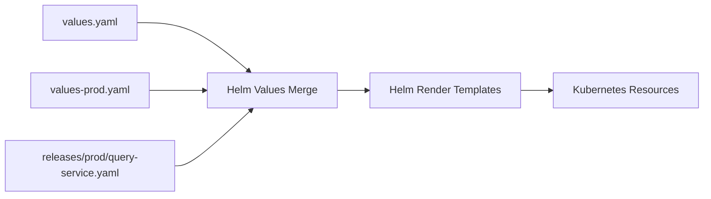

# 物联网管理系统 Helm Chart 目录样例

**Document Version:** 1.0  
**Date:** 2026-03-08  
**Author:** System Architect  
**Status:** Draft

---

## 1. 文档目标

本文档作为 `docs/05-kubernetes-deployment-checklist-and-helm-template-iot-platform-2026-03-08.md` 的配套文档，提供一套更接近真实工程的 Helm Chart 目录样例，用于：

- 统一 IoT 平台各 Go 服务的 Helm Chart 结构
- 统一环境差异文件组织方式
- 统一模板文件拆分方式
- 统一发布时的 values 管理方式

适用对象：

- `DevOps/SRE`
- `后端开发`
- `技术负责人`

---

## 2. 推荐目录组织

建议把 Helm 相关文件统一放在仓库的 `deploy/helm/` 目录下。

### 2.1 单 Chart 多服务方式

适用于：
- 平台服务部署规范高度统一
- 团队希望降低 Chart 维护成本
- 各服务主要差异体现在 values 文件

```text
deploy/
  helm/
    iot-service/
      Chart.yaml
      values.yaml
      values-dev.yaml
      values-staging.yaml
      values-prod.yaml
      templates/
        _helpers.tpl
        deployment.yaml
        service.yaml
        configmap.yaml
        secret.yaml
        hpa.yaml
        pdb.yaml
        serviceaccount.yaml
        servicemonitor.yaml
        networkpolicy.yaml
        ingress.yaml
        NOTES.txt
```

### 2.2 多 Chart 方式

适用于：
- 各服务差异较大
- 某些服务需要独立生命周期管理
- 计划通过 GitOps 独立发布不同服务

```text
deploy/
  helm/
    mqtt-auth-service/
      Chart.yaml
      values.yaml
      values-dev.yaml
      values-staging.yaml
      values-prod.yaml
      templates/
        _helpers.tpl
        deployment.yaml
        service.yaml
        configmap.yaml
        secret.yaml
        hpa.yaml
        pdb.yaml
        serviceaccount.yaml
        servicemonitor.yaml
        networkpolicy.yaml
    message-ingest-service/
      Chart.yaml
      values.yaml
      values-dev.yaml
      values-staging.yaml
      values-prod.yaml
      templates/
        _helpers.tpl
        deployment.yaml
        service.yaml
        configmap.yaml
        secret.yaml
        hpa.yaml
        pdb.yaml
        serviceaccount.yaml
        servicemonitor.yaml
        networkpolicy.yaml
    query-service/
      ...
    command-service/
      ...
```

### 2.3 推荐结论

对于当前 IoT 平台，建议：

- **第一阶段** 使用 `单 Chart 多服务方式`
- **第二阶段** 当服务差异增大后，再按核心服务拆成独立 Chart

原因：
- 起步阶段模板复用率高
- 服务大多是标准 Go HTTP/gRPC 服务
- 统一模板更利于治理探针、HPA、PDB、日志与监控规范

---

## 3. 推荐目录树（落地版）

以下是更贴近实际的推荐目录：

```text
deploy/
  helm/
    charts/
      iot-service/
        Chart.yaml
        values.yaml
        values-dev.yaml
        values-staging.yaml
        values-prod.yaml
        templates/
          _helpers.tpl
          deployment.yaml
          service.yaml
          configmap.yaml
          secret.yaml
          hpa.yaml
          pdb.yaml
          serviceaccount.yaml
          servicemonitor.yaml
          networkpolicy.yaml
          ingress.yaml
          NOTES.txt
    releases/
      dev/
        mqtt-auth-service.yaml
        message-ingest-service.yaml
        device-service.yaml
        shadow-service.yaml
        command-service.yaml
        query-service.yaml
      staging/
        mqtt-auth-service.yaml
        message-ingest-service.yaml
        device-service.yaml
        shadow-service.yaml
        command-service.yaml
        query-service.yaml
      prod/
        mqtt-auth-service.yaml
        message-ingest-service.yaml
        device-service.yaml
        shadow-service.yaml
        command-service.yaml
        query-service.yaml
```

这里的设计思路是：

- `charts/` 放通用模板
- `releases/` 放环境级服务实例配置
- 每个服务在不同环境下有独立 values 覆写文件

---

## 4. 目录职责说明

| 路径 | 职责 |
|---|---|
| `deploy/helm/charts/iot-service/Chart.yaml` | Chart 元信息 |
| `deploy/helm/charts/iot-service/values.yaml` | 通用默认值 |
| `deploy/helm/charts/iot-service/values-dev.yaml` | 开发环境默认值 |
| `deploy/helm/charts/iot-service/values-staging.yaml` | 预发环境默认值 |
| `deploy/helm/charts/iot-service/values-prod.yaml` | 生产环境默认值 |
| `deploy/helm/charts/iot-service/templates/` | K8s 模板文件 |
| `deploy/helm/releases/dev/*.yaml` | 某服务在 dev 环境的服务级覆写 |
| `deploy/helm/releases/staging/*.yaml` | 某服务在 staging 环境的服务级覆写 |
| `deploy/helm/releases/prod/*.yaml` | 某服务在 prod 环境的服务级覆写 |

---

## 5. 推荐发布合并方式

建议 Helm 发布时按以下顺序叠加 values：

1. `values.yaml`
2. `values-{env}.yaml`
3. `releases/{env}/{service}.yaml`

例如生产环境发布 `query-service`：

```bash
helm upgrade --install query-service deploy/helm/charts/iot-service \
  -n iot-platform \
  -f deploy/helm/charts/iot-service/values.yaml \
  -f deploy/helm/charts/iot-service/values-prod.yaml \
  -f deploy/helm/releases/prod/query-service.yaml
```

这样做的优点：

- 保持基础模板一致
- 环境差异集中管理
- 服务个性化配置清晰可追踪

---

## 6. Chart 文件样例

## 6.1 `Chart.yaml`

```yaml
apiVersion: v2
name: iot-service
description: Common Helm chart for IoT platform Go services
type: application
version: 0.1.0
appVersion: "1.0.0"
```

## 6.2 `_helpers.tpl`

```yaml
{{- define "iot-service.name" -}}
{{- default .Chart.Name .Values.nameOverride | trunc 63 | trimSuffix "-" -}}
{{- end -}}

{{- define "iot-service.fullname" -}}
{{- if .Values.fullnameOverride -}}
{{- .Values.fullnameOverride | trunc 63 | trimSuffix "-" -}}
{{- else -}}
{{- printf "%s-%s" .Release.Name (include "iot-service.name" .) | trunc 63 | trimSuffix "-" -}}
{{- end -}}
{{- end -}}

{{- define "iot-service.labels" -}}
app.kubernetes.io/name: {{ include "iot-service.name" . }}
app.kubernetes.io/instance: {{ .Release.Name }}
app.kubernetes.io/version: {{ .Chart.AppVersion }}
app.kubernetes.io/managed-by: {{ .Release.Service }}
{{- end -}}
```

## 6.3 `deployment.yaml` 需要覆盖的重点

- 副本数
- 镜像
- 资源限制
- 环境变量
- 探针
- 亲和性
- 优雅退出
- metrics 端口

---

## 7. 服务级 values 文件样例

## 7.1 `releases/prod/query-service.yaml`

```yaml
fullnameOverride: query-service

replicaCount: 4

image:
  repository: registry.example.com/iot/query-service
  tag: v1.0.0

service:
  port: 8080
  metricsPort: 9090

resources:
  requests:
    cpu: "1"
    memory: "1Gi"
  limits:
    cpu: "2"
    memory: "2Gi"

autoscaling:
  enabled: true
  minReplicas: 4
  maxReplicas: 12
  targetCPUUtilizationPercentage: 60

config:
  appEnv: prod
  logLevel: info
  readReplicaEnabled: "true"
  redisCacheTTL: "60"
  queryTimeoutMs: "3000"

nodeSelector:
  workload: service
```

## 7.2 `releases/prod/message-ingest-service.yaml`

```yaml
fullnameOverride: message-ingest-service

replicaCount: 4

image:
  repository: registry.example.com/iot/message-ingest-service
  tag: v1.0.0

resources:
  requests:
    cpu: "1"
    memory: "1Gi"
  limits:
    cpu: "4"
    memory: "2Gi"

autoscaling:
  enabled: true
  minReplicas: 4
  maxReplicas: 12
  targetCPUUtilizationPercentage: 65

config:
  appEnv: prod
  logLevel: info
  consumerConcurrency: "8"
  maxMessageBytes: "2097152"
  kafkaTopicTelemetry: telemetry.raw
  kafkaTopicEvent: event.raw

nodeSelector:
  workload: gateway
```

---

## 8. GitOps 目录样例

如果后续接入 Argo CD 或 Flux，建议目录如下：

```text
gitops/
  apps/
    dev/
      query-service.yaml
      message-ingest-service.yaml
    staging/
      query-service.yaml
      message-ingest-service.yaml
    prod/
      query-service.yaml
      message-ingest-service.yaml
  values/
    dev/
      query-service.yaml
      message-ingest-service.yaml
    staging/
      query-service.yaml
      message-ingest-service.yaml
    prod/
      query-service.yaml
      message-ingest-service.yaml
```

---

## 9. Helm Chart 与发布关系图



---

## 10. 模板拆分建议

### 必须模板

- `deployment.yaml`
- `service.yaml`
- `configmap.yaml`
- `secret.yaml`
- `serviceaccount.yaml`
- `hpa.yaml`
- `pdb.yaml`

### 建议模板

- `servicemonitor.yaml`
- `networkpolicy.yaml`
- `ingress.yaml`
- `NOTES.txt`

### 可选模板

- `externalsecret.yaml`
- `prometheusrule.yaml`
- `cronjob.yaml`

---

## 11. 维护规范建议

- 所有新服务优先复用统一 Chart
- 不允许每个服务自行维护完全不同的模板风格
- values 文件命名保持统一
- 生产环境 values 变更必须走评审
- Chart 变更需要验证 `helm template` 与 `helm lint`

---

## 12. 推荐下一步

在本文档基础上，最适合继续补的内容是：

1. `deployment.yaml / service.yaml / hpa.yaml` 实际模板样例  
2. `query-service` 与 `message-ingest-service` 的完整 `values-prod.yaml`  3. `Argo CD Application` 样例  

---

## 13. 结论

本文档给出了一套适合当前 IoT 平台的 Helm Chart 目录样例，核心思路是：

- 用统一 Chart 管理共性
- 用环境 values 管理环境差异
- 用服务级 release 文件管理服务个性配置
- 为后续 GitOps 演进保留清晰结构
