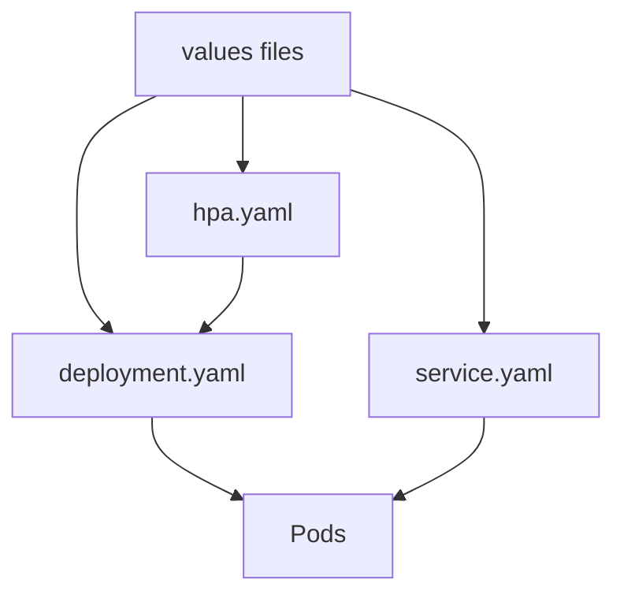

# 物联网管理系统 Helm 模板样例（deployment.yaml / service.yaml / hpa.yaml）

**Document Version:** 1.0  
**Date:** 2026-03-08  
**Author:** System Architect  
**Status:** Draft

---

## 1. 文档目标

本文档提供 IoT 平台 Go 微服务在 Helm Chart 中最核心的三个模板样例：

- `deployment.yaml`
- `service.yaml`
- `hpa.yaml`

目标是让团队可以直接基于这些模板落地统一的 Helm Chart，实现：

- 部署规范统一
- 资源配置统一
- 探针与弹性策略统一
- 环境差异通过 values 文件管理

本文档建议与以下文档配合阅读：

- `docs/05-kubernetes-deployment-checklist-and-helm-template-iot-platform-2026-03-08.md`
- `docs/05a-helm-chart-directory-example-iot-platform-2026-03-08.md`

---

## 2. 模板设计原则

- 所有模板默认适配 `Go HTTP/gRPC` 服务
- 所有可变项尽量从 `values.yaml` 注入
- 模板尽量保持可复用，不写死服务特性
- 模板默认支持生产环境必备能力：
  - 资源 request/limit
  - 健康检查
  - HPA
  - PDB
  - 亲和/反亲和
  - 安全上下文

---

## 3. values 依赖字段说明

以下模板默认依赖这些 values 字段：

- `fullnameOverride`
- `replicaCount`
- `image.repository`
- `image.tag`
- `image.pullPolicy`
- `service.port`
- `service.metricsPort`
- `resources`
- `autoscaling.*`
- `probes.*`
- `config.*`
- `podAnnotations`
- `podLabels`
- `nodeSelector`
- `affinity`
- `tolerations`
- `serviceAccount.*`

---

## 4. `deployment.yaml` 模板样例

```yaml
apiVersion: apps/v1
kind: Deployment
metadata:
  name: {{ include "iot-service.fullname" . }}
  labels:
    {{- include "iot-service.labels" . | nindent 4 }}
spec:
  {{- if not .Values.autoscaling.enabled }}
  replicas: {{ .Values.replicaCount }}
  {{- end }}
  revisionHistoryLimit: 5
  strategy:
    type: RollingUpdate
    rollingUpdate:
      maxUnavailable: 0
      maxSurge: 25%
  selector:
    matchLabels:
      app.kubernetes.io/name: {{ include "iot-service.name" . }}
      app.kubernetes.io/instance: {{ .Release.Name }}
  template:
    metadata:
      labels:
        {{- include "iot-service.labels" . | nindent 8 }}
        {{- with .Values.podLabels }}
        {{- toYaml . | nindent 8 }}
        {{- end }}
      annotations:
        checksum/config: {{ include (print $.Template.BasePath "/configmap.yaml") . | sha256sum }}
        checksum/secret: {{ include (print $.Template.BasePath "/secret.yaml") . | sha256sum }}
        {{- with .Values.podAnnotations }}
        {{- toYaml . | nindent 8 }}
        {{- end }}
    spec:
      serviceAccountName: {{ include "iot-service.fullname" . }}
      terminationGracePeriodSeconds: {{ .Values.terminationGracePeriodSeconds | default 30 }}
      securityContext:
        {{- toYaml .Values.podSecurityContext | nindent 8 }}
      containers:
        - name: {{ include "iot-service.name" . }}
          image: "{{ .Values.image.repository }}:{{ .Values.image.tag }}"
          imagePullPolicy: {{ .Values.image.pullPolicy }}
          ports:
            - name: http
              containerPort: {{ .Values.service.port }}
              protocol: TCP
            - name: metrics
              containerPort: {{ .Values.service.metricsPort }}
              protocol: TCP
          env:
            - name: APP_ENV
              value: {{ .Values.config.appEnv | quote }}
            - name: LOG_LEVEL
              value: {{ .Values.config.logLevel | quote }}
            - name: HTTP_PORT
              value: {{ .Values.config.httpPort | quote }}
            - name: METRICS_PORT
              value: {{ .Values.config.metricsPort | quote }}
            - name: OTEL_EXPORTER_OTLP_ENDPOINT
              value: {{ .Values.config.otelEndpoint | quote }}
            - name: KAFKA_BROKERS
              value: {{ .Values.config.kafkaBrokers | quote }}
            - name: REDIS_ADDR
              value: {{ .Values.config.redisAddr | quote }}
            - name: PG_DSN
              valueFrom:
                secretKeyRef:
                  name: {{ include "iot-service.fullname" . }}
                  key: pgDsn
            - name: APP_SECRET
              valueFrom:
                secretKeyRef:
                  name: {{ include "iot-service.fullname" . }}
                  key: appSecret
          envFrom:
            - configMapRef:
                name: {{ include "iot-service.fullname" . }}
          resources:
            {{- toYaml .Values.resources | nindent 12 }}
          readinessProbe:
            httpGet:
              path: {{ .Values.probes.readiness.path }}
              port: http
            initialDelaySeconds: {{ .Values.probes.readiness.initialDelaySeconds }}
            periodSeconds: {{ .Values.probes.readiness.periodSeconds }}
            timeoutSeconds: {{ .Values.probes.readiness.timeoutSeconds }}
          livenessProbe:
            httpGet:
              path: {{ .Values.probes.liveness.path }}
              port: http
            initialDelaySeconds: {{ .Values.probes.liveness.initialDelaySeconds }}
            periodSeconds: {{ .Values.probes.liveness.periodSeconds }}
            timeoutSeconds: {{ .Values.probes.liveness.timeoutSeconds }}
          securityContext:
            {{- toYaml .Values.securityContext | nindent 12 }}
      {{- with .Values.imagePullSecrets }}
      imagePullSecrets:
        {{- toYaml . | nindent 8 }}
      {{- end }}
      {{- with .Values.nodeSelector }}
      nodeSelector:
        {{- toYaml . | nindent 8 }}
      {{- end }}
      {{- with .Values.affinity }}
      affinity:
        {{- toYaml . | nindent 8 }}
      {{- end }}
      {{- with .Values.tolerations }}
      tolerations:
        {{- toYaml . | nindent 8 }}
      {{- end }}
```

### 4.1 模板说明

- `checksum/config` 与 `checksum/secret` 用于配置变更触发 Pod 重建
- 当 HPA 开启时，不在 Deployment 中显式写死 `replicas`
- 同时暴露 `http` 和 `metrics` 端口，方便 ServiceMonitor 抓取
- `PG_DSN` 与 `APP_SECRET` 等敏感信息从 `Secret` 注入
- `envFrom configMapRef` 用于注入非敏感业务配置

### 4.2 推荐补充项

如有需要，可继续补充：

- `startupProbe`
- `lifecycle.preStop`
- `topologySpreadConstraints`
- `extraEnv` / `extraVolumes` / `extraVolumeMounts`

---

## 5. `service.yaml` 模板样例

```yaml
apiVersion: v1
kind: Service
metadata:
  name: {{ include "iot-service.fullname" . }}
  labels:
    {{- include "iot-service.labels" . | nindent 4 }}
spec:
  type: {{ .Values.service.type }}
  selector:
    app.kubernetes.io/name: {{ include "iot-service.name" . }}
    app.kubernetes.io/instance: {{ .Release.Name }}
  ports:
    - name: http
      port: {{ .Values.service.port }}
      targetPort: http
      protocol: TCP
    - name: metrics
      port: {{ .Values.service.metricsPort }}
      targetPort: metrics
      protocol: TCP
```

### 5.1 模板说明

- 默认定义 `http` 与 `metrics` 两个端口
- 对于纯内部服务，`type` 建议使用 `ClusterIP`
- 对于需要被网关路由的服务，不建议直接使用 `LoadBalancer`

### 5.2 特殊情况建议

- 如果服务不暴露 metrics 端口，可通过 values 增加开关
- 如果是 gRPC-only 服务，可把 `http` 端口名改为 `grpc`
- 如果由 APISIX/Ingress 统一入口，Service 只保留内网访问能力

---

## 6. `hpa.yaml` 模板样例

```yaml
{{- if .Values.autoscaling.enabled }}
apiVersion: autoscaling/v2
kind: HorizontalPodAutoscaler
metadata:
  name: {{ include "iot-service.fullname" . }}
  labels:
    {{- include "iot-service.labels" . | nindent 4 }}
spec:
  scaleTargetRef:
    apiVersion: apps/v1
    kind: Deployment
    name: {{ include "iot-service.fullname" . }}
  minReplicas: {{ .Values.autoscaling.minReplicas }}
  maxReplicas: {{ .Values.autoscaling.maxReplicas }}
  metrics:
    - type: Resource
      resource:
        name: cpu
        target:
          type: Utilization
          averageUtilization: {{ .Values.autoscaling.targetCPUUtilizationPercentage }}
    - type: Resource
      resource:
        name: memory
        target:
          type: Utilization
          averageUtilization: {{ .Values.autoscaling.targetMemoryUtilizationPercentage }}
  behavior:
    scaleUp:
      stabilizationWindowSeconds: 0
      selectPolicy: Max
      policies:
        - type: Percent
          value: 100
          periodSeconds: 60
        - type: Pods
          value: 4
          periodSeconds: 60
    scaleDown:
      stabilizationWindowSeconds: 300
      selectPolicy: Min
      policies:
        - type: Percent
          value: 20
          periodSeconds: 60
{{- end }}
```

### 6.1 模板说明

- 使用 `autoscaling/v2` 便于支持更灵活的扩缩容行为
- 默认按 `CPU + Memory` 双指标扩容
- `scaleDown.stabilizationWindowSeconds: 300` 用于避免抖动缩容
- 对消息处理类服务，建议后续接入外部指标，如 `Kafka lag`

### 6.2 更进一步的建议

如果平台后续接入 `KEDA`，可将消息消费者类服务的 HPA 改为：

- Kafka lag 驱动
- Queue depth 驱动
- Cron 时间窗驱动

---

## 7. 模板之间的关系图



---

## 8. 配套 values 示例

以下 values 片段可用于让上述模板正常渲染。

```yaml
fullnameOverride: query-service

replicaCount: 4

image:
  repository: registry.example.com/iot/query-service
  tag: v1.0.0
  pullPolicy: IfNotPresent

service:
  type: ClusterIP
  port: 8080
  metricsPort: 9090

resources:
  requests:
    cpu: "1"
    memory: "1Gi"
  limits:
    cpu: "2"
    memory: "2Gi"

autoscaling:
  enabled: true
  minReplicas: 4
  maxReplicas: 12
  targetCPUUtilizationPercentage: 60
  targetMemoryUtilizationPercentage: 70

terminationGracePeriodSeconds: 30

podAnnotations:
  prometheus.io/scrape: "true"
  prometheus.io/port: "9090"

podLabels: {}

podSecurityContext:
  runAsNonRoot: true
  fsGroup: 2000

securityContext:
  allowPrivilegeEscalation: false
  readOnlyRootFilesystem: true
  runAsUser: 10001
  runAsGroup: 10001
  capabilities:
    drop:
      - ALL

imagePullSecrets:
  - name: regcred

probes:
  readiness:
    path: /readyz
    initialDelaySeconds: 5
    periodSeconds: 5
    timeoutSeconds: 2
  liveness:
    path: /healthz
    initialDelaySeconds: 10
    periodSeconds: 10
    timeoutSeconds: 2

config:
  appEnv: prod
  logLevel: info
  httpPort: "8080"
  metricsPort: "9090"
  otelEndpoint: tempo.iot-observe.svc.cluster.local:4317
  kafkaBrokers: kafka-0:9092,kafka-1:9092,kafka-2:9092
  redisAddr: redis-master.iot-platform.svc.cluster.local:6379

nodeSelector:
  workload: service

tolerations: []

affinity:
  podAntiAffinity:
    preferredDuringSchedulingIgnoredDuringExecution:
      - weight: 100
        podAffinityTerm:
          topologyKey: kubernetes.io/hostname
          labelSelector:
            matchLabels:
              app.kubernetes.io/name: query-service
```

---

## 9. 模板落地建议

### 9.1 第一阶段

先把这 3 个模板作为统一基线，满足 80% 的服务部署需求。

### 9.2 第二阶段

再按服务类型拆分增强模板，例如：

- HTTP API 服务模板
- Kafka Consumer 服务模板
- CronJob/Batch 服务模板
- gRPC-only 服务模板

### 9.3 不建议的做法

- 每个服务复制一套模板后各自维护
- 模板中写死大量服务名与环境名
- 在 values 中塞过多不属于部署层的业务逻辑参数

---

## 10. 推荐下一步

在这 3 个模板之后，建议继续补：

- `configmap.yaml` 模板样例
- `secret.yaml` 模板样例
- `serviceaccount.yaml` 模板样例
- `pdb.yaml` 模板样例
- `networkpolicy.yaml` 模板样例

---

## 11. 结论

本文档给出了 IoT 平台最核心的 3 个 Helm 模板样例，已经足够作为 Helm Chart 的第一版基线。

如果团队希望进一步进入“可直接落库/可直接提交代码”的状态，下一步最合适的是把这些模板直接生成到 `deploy/helm/charts/iot-service/templates/` 目录结构中。
